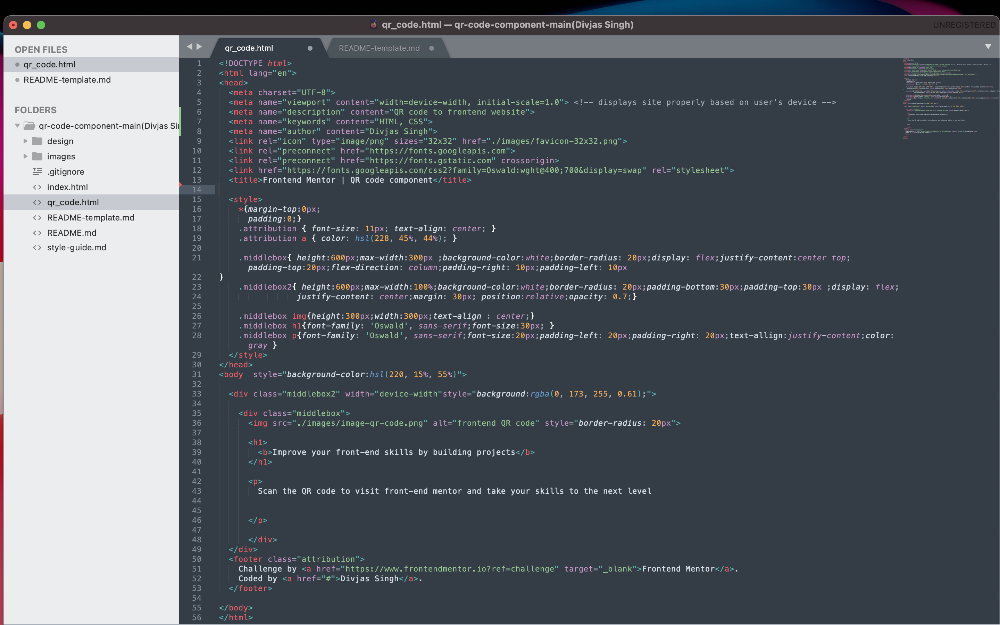

# Frontend Mentor - QR code component solution

This is a solution to the [QR code component challenge on Frontend Mentor](https://www.frontendmentor.io/challenges/qr-code-component-iux_sIO_H). Frontend Mentor challenges help you improve your coding skills by building realistic projects. 

## Table of contents

- [Overview](#overview)
  - [Screenshot](#screenshot)
  - [Links](#links)
- [My process](#my-process)
  - [Built with](#built-with)
  - [What I learned](#what-i-learned)
  - [Continued development](#continued-development)
  - [Useful resources](#useful-resources)
- [Author](#author)
- [Acknowledgments](#acknowledgments)

**Note: Delete this note and update the table of contents based on what sections you keep.**

## Overview

### Screenshot



Add a screenshot of your solution. The easiest way to do this is to use Firefox to view your project, right-click the page and select "Take a Screenshot". You can choose either a full-height screenshot or a cropped one based on how long the page is. If it's very long, it might be best to crop it.

Alternatively, you can use a tool like [FireShot](https://getfireshot.com/) to take the screenshot. FireShot has a free option, so you don't need to purchase it. 

Then crop/optimize/edit your image however you like, add it to your project, and update the file path in the image above.


### Built with

- Semantic HTML5 markup
- CSS custom properties
- Flexbox
- CSS Grid
- [google fonts] - For styles

**Note: These are just examples. Delete this note and replace the list above with your own choices**

### What I learned

I learned mainly the use of classes and how to create a layouot for a site.Also this project used flexbox which was for the container with the main content and img.

To see how you can add code snippets, see below:

```CSS
.middlebox{ height:600px;max-width:300px ;background-color:white;border-radius: 20px;display: flex;justify-content:center top;padding-top:20px;flex-direction: column;padding-right: 10px;padding-left: 10px
}
.middlebox2{ height:600px;max-width:100%;background-color:white;border-radius: 20px;padding-bottom:30px;padding-top:30px ;display: flex;
                justify-content: center;margin: 30px; position:relative;opacity: 0.7;}
.middlebox img{height:300px;width:300px;text-align : center;}
.middlebox h1{font-family: 'Oswald', sans-serif;font-size:30px; }
.middlebox p{font-family: 'Oswald', sans-serif;font-size:20px;padding-left: 20px;padding-right: 20px;text-allign:justify-content;color: gray }
```

### Continued development

I want to develop more in advanced css concepts combined with javascript to make more dynamic websites


### Useful resources

- [ resource 1](https://www.w3schools.com/css) - This helped me in understanding flexbox and relative positioning. I really liked this pattern and will use it going forward.


## Author

- Website - [Divjas Singh Anand]
- Frontend Mentor - [@Divjas-Singh](https://www.frontendmentor.io/profile/Divjas-Singh)


